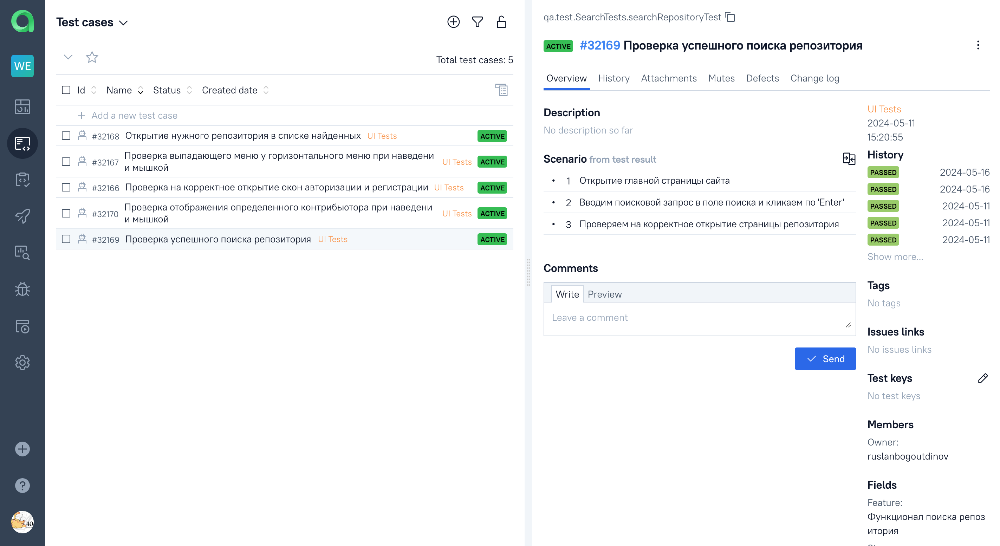

# Демо-проект по автоматизации тестирования сайта [GitHub](https://github.com/)

<p align="center">
  
</p>

##	Содержание

* <a href="#cases">Реализованные проверки</a>

* <a href="#console">Запуск тестов из терминала</a>

* <a href="#jenkins">Запуск тестов в Jenkins</a>

* <a href="#allure">Отчет в Allure Report</a>

* <a href="#allure-testops">Интеграция с Allure TestOps</a>

* <a href="#telegram">Telegram уведомление</a>

* <a href="#video">Видео пример прогона автотеста</a>

<a id="cases"></a>
## Реализованные проверки

- [x] Проверка успешного поиска репозитория
- [x] Открытие нужного репозитория в списке найденных
- [x] Проверка отображения определенного конрибьютора при наведении мышкой
- [x] Проверка выпадающего меню у горизонтального меню при наведении мышкой
- [x] Проверка на корректное открытие окон авторизации и регистрации

<a id="console"></a>
## Запуск тестов из терминала
### Локальный запуск тестов

```bash
gradle clean test
```

### Удаленный запуск тестов

```bash
gradle clean test

-Dbrowser=${browser}
-DbrowserVersion=${browserVersion}
-DbrowserSize=${browserSize}
-DremoteUrl=${remoteUrl}
```

### Параметры запуска

<code>browser</code> – браузер, в котором будут выполняться тесты (_по умолчанию - <code>chrome</code>_).

<code>browserVersion</code> – версия браузера (_по умолчанию - <code>100</code>_).

<code>browserSize</code> – размер окна браузера, в котором будут выполняться тесты (_по умолчанию - <code>1920x1080</code>_).

<code>remoteURL</code> - адрес удаленного сервера, где будут запускаться тесты.

<a id="jenkins"></a>
##  Запуск тестов в [Jenkins](https://jenkins.autotests.cloud/job/portfolio_web_tests/)

#### Главная страница Jenkins

<p align="center">
  
</p>

#### Настройка параметров

<p align="center">
  
</p>

> Для запуска сборки необходимо открыть страницу с параметрами, нажав кнопку <code><strong>*Build with Parameters*</strong></code>. 
> Далее указать значения параметров и нажать кнопку <code><strong>*Build*</strong></code>.

<a id="allure_report_and_allure_testops"></a>
#### Значки Allure Report и Allure TestOps

<p align="center">
  
</p>

> Клик по иконкам <strong>*Allure TestOps*</strong> и <strong>*Allure Report*</strong> позволяет перейти
> на просмотр страниц с тестовой документацией и отчетов.

<a id="allure"></a>
## </a> Отчет в [Allure Report](https://jenkins.autotests.cloud/job/portfolio_web_tests/allure/)

#### Главная страница Allure Report

<p align="center">
  
</p>

#### Тесты

<p align="center">
  
</p>

#### Графики

<p align="center">
  
</p>

<a id="allure-testops"></a>
## </a> Интеграция с [Allure TestOps](https://allure.autotests.cloud/launch/38844)

> В <strong>*Allure TestOps*</strong> есть возможность наблюдать за выполнением тестов в реальном времени.

#### Ход выполнения теста

<p align="center">
  
</p>

#### Тест-кейсы

<p align="center">
  
</p>

#### Дашборды

<p align="center">
  
</p>

<a id="telegram"></a>
## </a> Telegram уведомление

#### Оповещение о результатах сборки

<p>
  
</p>

<a id="video"></a>
## Пример запуска теста

К каждому тесту в отчете прилагается видео.

На данном видео выполняется:

- Проверка функции добавления товара в Избранные

<p align="center">
  
</p>