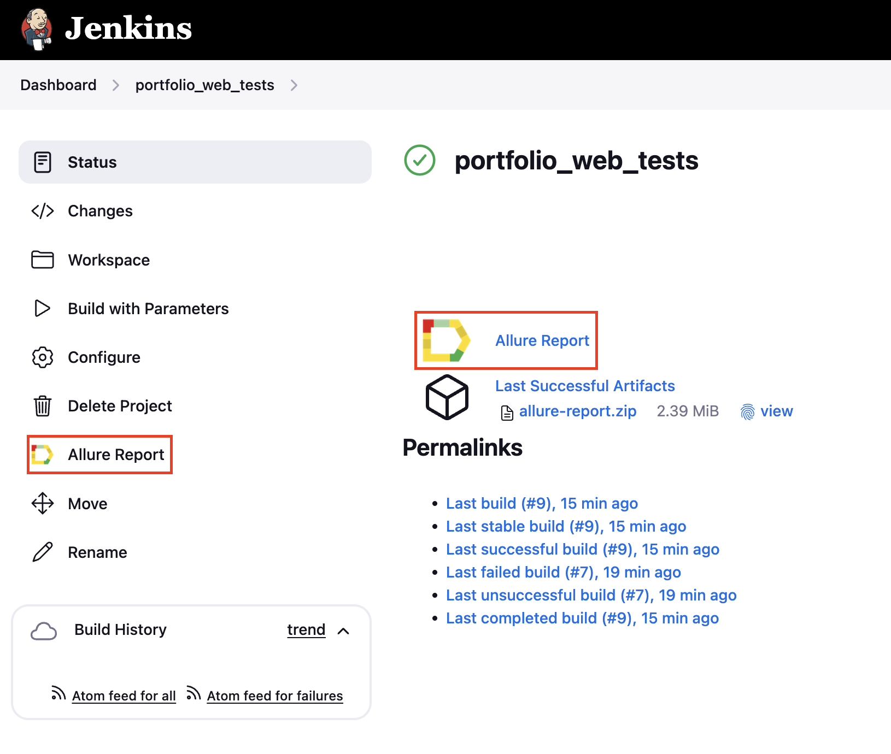
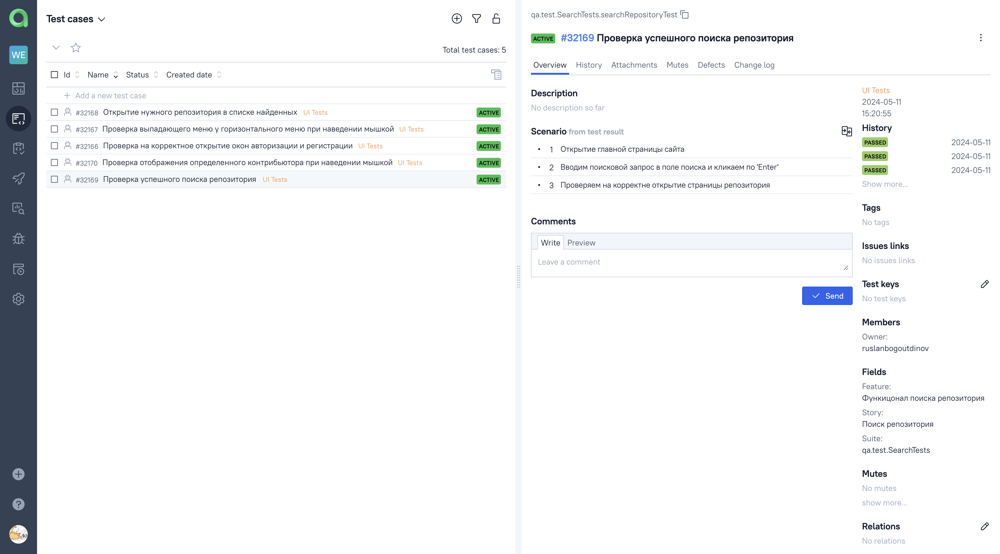

# Демо-проект по автоматизации тестирования сайта [GitHub](https://github.com/)

<p align="center">
  
</p>

##	Содержание

- [Реализованныe проверки](#реализованные-проверки)
- [Запуск тестов из терминала](#запуск-тестов-из-терминала)
- [Запуск тестов в Jenkins](#запуск-тестов-в-jenkins)
- [Отчет о результатах тестирования в Allure Report](#отчет-о-результатах-тестирования-в-Allure-report)
- [Интеграция с Allure TestOps](#интеграция-с-allure-testops)
- [Уведомления в Telegram с использованием бота](#уведомления-в-telegram-с-использованием-бота)
- [Пример запуска теста в Selenoid](#пример-запуска-теста-в-selenoid)

## Реализованные проверки

- [x] Проверка успешного поиска репозитория
- [x] Открытие нужного репозитория в списке найденных
- [x] Проверка отображения определенного конрибьютора при наведении мышкой
- [x] Проверка выпадающего меню у горизонтального меню при наведении мышкой
- [x] Проверка на корректное открытие окон авторизации и регистрации

## Запуск тестов из терминала
### Локальный запуск тестов

```bash
gradle clean test
```

### Удаленный запуск тестов

```bash
gradle clean test

-Dbrowser=${browser}
-DbrowserVersion=${browserVersion}
-DbrowserSize=${browserSize}
-DremoteUrl=${remoteUrl}
```

### Параметры запуска

<code>browser</code> – браузер, в котором будут выполняться тесты (_по умолчанию - <code>chrome</code>_).

<code>browserVersion</code> – версия браузера (_по умолчанию - <code>100</code>_).

<code>browserSize</code> – размер окна браузера, в котором будут выполняться тесты (_по умолчанию - <code>1920x1080</code>_).

<code>remoteURL</code> - адрес удаленного сервера, где будут запускаться тесты.

## Запуск тестов в [Jenkins](https://jenkins.autotests.cloud/job/portfolio_web_tests/)

#### Главная страница Jenkins

<p align="center">
  
</p>

#### Настройка параметров

<p align="center">
  
</p>

Для запуска сборки необходимо открыть страницу с параметрами, нажав кнопку <code><strong>*Build with Parameters*</strong></code>. 
Далее указать значения параметров и нажать кнопку <code><strong>*Build*</strong></code>.

#### Значок Allure Report

<p align="center">
  
</p>

Результаты сборки можно посмотреть в Allure отчёте, кликнув на значок <code><strong>*Allure Report*</strong></code>.

## Отчет о результатах тестирования в [Allure Report](https://jenkins.autotests.cloud/job/portfolio_web_tests/allure/)

#### Главная страница Allure Report

<p align="center">
  
</p>

#### Тесты

<p align="center">
  
</p>

#### Графики

<p align="center">
  
</p>

## Интеграция с [Allure TestOps](https://allure.autotests.cloud/launch/38844)

В <code><strong>*Allure TestOps*</strong></code> есть возможность наблюдать за выполнением тестов в реальном времени.

#### Ход выполнения теста

<p align="center">
  
</p>

#### Тест-кейсы

<p align="center">
  
</p>

#### Дашборды

<p align="center">
  
</p>

## Уведомления в Telegram с использованием бота

#### Оповещение о результатах сборки

<p>
  
</p>

## Пример запуска теста

К каждому тесту в отчете прилагается видео.

На данном видео выполняется:

- Проверка функции добавления товара в Избранные

<p align="center">
  
</p>